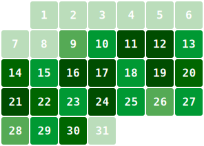
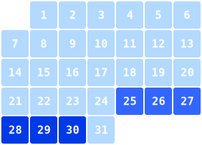

# GitHub Activity SVG

Generate Monthly Calendar SVGs for GitHub and Wakatime activies

|  Github |  Wakatime |
|----------------------------------------------------------------------------------------------|--------------------------------------------------------------------------------------------------|
|||

- enable GitHub Pages for the repository
- optional: add `WAKATIME_JSON_URL` to repository secrets (create a JSON embed at [wakatime](https://wakatime.com/share/embed) `JSON`, `Coding Activity`)

### Simple Action Usage
```yaml      
      - name: "Run Github Activity Action"
        uses: rehborn/github-activity-svg@v0.0.1
        with:
          months: 12
        env:
          GH_TOKEN: ${{ secrets.GITHUB_TOKEN }}
          GH_ACTOR: ${{ github.actor }}
          WAKATIME_JSON_URL: ${{ secrets.WAKATIME_JSON_URL }}
```

the action will store all SVGs in `dist/`, output filenames suffix the index, 
starting with 0 as the current month, going back in time as the index increases:   

- `gitlab-0.svg` (this month)
- `gitlab-1.svg` (last month)
- `wakatime-0.svg`
- `wakatime-1.svg`


### Complete Example Creating Artifact and Pushing to GitHub Pages
```yaml
name: Run Github Activity Action

on:
  workflow_dispatch:
    inputs:
      months:
        type: choice
        description: 'number of months to generate'
        options:
        - "1"
        - "2"
        - "3"
        - "6"
        - "12"
        - "24"

  schedule:
    - cron: '0 0,12,18 * * *'

permissions:
  contents: read
  pages: write
  id-token: write

jobs:
  generate-and-publish-svg:
    name: Generate Activity SVGs and Publish to Github Pages
    runs-on: ubuntu-latest

    steps:
      - uses: actions/checkout@v3

      - name: "Run Github Activity Action"
        uses: rehborn/github-activity-svg@v0.0.1
        with:
          months: ${{ inputs.months || '3' }}
        env:
          GH_TOKEN: ${{ secrets.GITHUB_TOKEN }}
          GH_ACTOR: ${{ github.actor }}
          WAKATIME_JSON_URL: ${{ secrets.WAKATIME_JSON_URL }}

      - name: Upload Web artifact
        uses: actions/upload-pages-artifact@v2
        with:
          path: ./dist/

      - name: Deploying Web artifact
        uses: actions/deploy-pages@v2
```

## Dependencies

- [DrawSVG](https://github.com/cduck/drawsvg)
- [requests](https://github.com/psf/requests)
- [python-dotenv](https://github.com/theskumar/python-dotenv)
- [python-dateutil](https://github.com/dateutil/dateutil)
